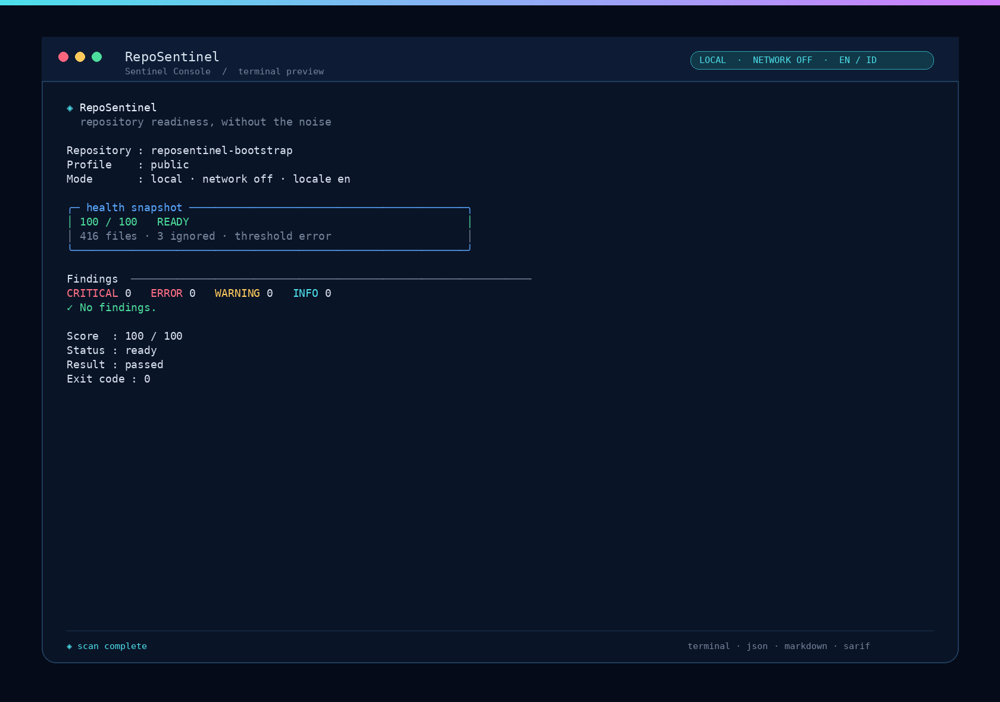
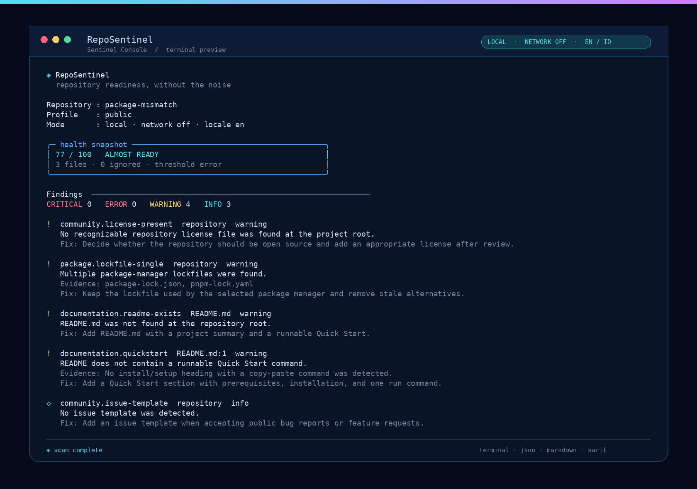
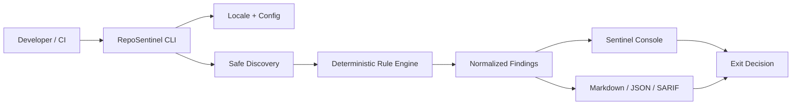

<div align="center">


[](docs/BETA_RELEASE.md)
[](docs/RepoSentinel_Project_Context.md)
[](docs/TECH_STACK_DECISIONS.md)

**Repository readiness, without the noise.**  
*Cek repository Anda sebelum orang lain menilainya.*

[English](#english) · [Bahasa Indonesia](#bahasa-indonesia) · [Governance](GOVERNANCE.md) · [Contributing](CONTRIBUTING.md) · [Security](SECURITY.md) · [Templates](#contribution--governance) · [Stable readiness](docs/RELEASE_READINESS.md) · [Roadmap](docs/ROADMAP_BETA_PRODUCTION.md) · [CLI UX](docs/RepoSentinel_CLI_Visual_Interaction_Spec.md) · [License](LICENSE)

</div>

> **Release status / Status rilis:** RepoSentinel is a verified **beta candidate**. The local CLI, multilingual output, SARIF reporter, baseline flow, package artifact, self-scan, GitHub Action, and documentation are implemented and validated. The CLI is published on npm as `reposentinel@0.1.0-beta.2` under the `beta` tag; the GitHub prerelease `v0.1.0-beta.1` remains the source snapshot. Pilot feedback and stable-release sign-off remain separate release activities.

## Contribution & governance

The repository is currently private while the production-readiness and documentation gates are being completed. The contribution process is already visible and documented from this page; repository visibility will change only after an explicit maintainer approval.

| English | Bahasa Indonesia |
|---|---|
| [Governance Hub](GOVERNANCE.md) — the central process index | [Governance Hub](GOVERNANCE.md) — indeks proses utama |
| [Contributing Guide](CONTRIBUTING.md) — setup, scope, testing, and Pull Requests | [Panduan Kontribusi](CONTRIBUTING.md) — setup, scope, testing, dan Pull Request |
| [Code of Conduct](CODE_OF_CONDUCT.md) — community standards and reporting | [Code of Conduct](CODE_OF_CONDUCT.md) — standar komunitas dan pelaporan |
| [Security Policy](SECURITY.md) — private disclosure and security boundaries | [Security Policy](SECURITY.md) — pelaporan privat dan batas keamanan |
| [Pull Request template](.github/pull_request_template.md) | [Template Pull Request](.github/pull_request_template.md) |
| [Issue templates](.github/ISSUE_TEMPLATE/) — bug, feature, docs, question, product feedback | [Template Issue](.github/ISSUE_TEMPLATE/) — bug, feature, docs, question, product feedback |
| [GitHub Governance](docs/GITHUB_GOVERNANCE.md) — CODEOWNERS and branch protection policy | [GitHub Governance](docs/GITHUB_GOVERNANCE.md) — CODEOWNERS dan kebijakan branch protection |

**Safe contribution rule / Aturan kontribusi aman:** never publish secrets, private keys, `.env` contents, proprietary source, unredacted logs, or an unpatched vulnerability in a public Issue or Pull Request. / Jangan pernah mengirim secret, private key, isi `.env`, proprietary source, log yang belum disanitasi, atau vulnerability yang belum ditambal melalui Issue atau Pull Request publik.

---

## English

### The idea

Good code can still look unready when the README is unclear, Quick Start is missing, demo links are broken, screenshots do not resolve, package metadata conflicts, `.env` enters Git, or contributors do not know where to begin.

RepoSentinel is a local-first developer tool that checks the layer around the code: **documentation, discoverability, links, assets, package hygiene, Git metadata, security hygiene, CI configuration, and contributor readiness**. It is designed to feel like a calm, actionable repository linter—not a wall of cryptic warnings.

### What makes it different

| Pillar | What it means |
|---|---|
| **Local-first** | Source code stays on the user’s machine during local scans. Network rules are opt-in. |
| **Deterministic** | The same repository and configuration produce the same normalized findings. |
| **Explainable** | Every finding has a rule ID, severity, location, evidence, impact, and remediation. |
| **Profile-driven** | `public`, `portfolio`, `npm-package`, `academic`, `private-team`, and `mobile-app` repositories can express different readiness contexts. |
| **Safe by default** | The scanner reads the target as data and does not run its package scripts or build commands. |
| **Multilingual** | UI copy and documentation can be localized while rule IDs and machine schemas remain stable. |

### What it checks

```text
README & docs       Quick Start · description · headings · structure
Links & assets      URLs · images · badges · demo references
Security hygiene    .env · private keys · high-confidence credential patterns
Package hygiene     lockfiles · manifest · scripts · package metadata
Git metadata        .gitignore · tracked generated files · large files
Community           license presence · issue templates · contributor readiness · Code of Conduct
CI & automation     workflow permissions · release metadata · syntax hints
Portfolio profile   summary · tech stack · screenshot · visible demo
```

### Verified workflow

```text
install → check → understand finding → fix → check again → share
```

The current beta keeps the one-shot report deterministic and CI-safe. Interactive prompts are limited to `init`; terminal scan output is intentionally stable for copy, pipe, and regression testing.

```text
$ reposentinel check . --profile public --lang en

◈ RepoSentinel
  repository readiness, without the noise

╭─ health snapshot ─────────────────────────────────────────────╮
│ 100 / 100   READY                                           │
│ 416 files · 3 ignored · threshold error                     │
╰────────────────────────────────────────────────────────────────╯

Findings  ────────────────────────────────────────────────────────
CRITICAL 0   ERROR 0   WARNING 0   INFO 0
✓ No findings.

Score  : 100 / 100
Status : ready
Result : passed
Exit code : 0
```

### Sentinel Console preview

The terminal UI uses a dark navy canvas with a cyan-to-violet accent line, cyan panel borders, muted context text, yellow warnings, red errors, and cyan info markers. Color is forced in interactive mode and can always be disabled with `--no-color` for CI, pipes, SSH fallback, and machine output. Static screenshots are the primary preview so the actual hierarchy and border geometry can be inspected without animation speed getting in the way.





[Open the optional MP4 demo](docs/assets/reposentinel-cli-demo.mp4)

| Token | Tone | Meaning |
|---|---|---|
| `cyan` | `#4DE0EB` | Brand, panel accents, info, interactive focus |
| `violet` | `#D27EFF` | Secondary brand accent and visual identity |
| `yellow` | `#FFCB5C` | Warning and attention |
| `red` | `#FF6F84` | Error and critical severity |
| `slate` | `#75849A` | Remediation, metadata, and secondary context |

### Quick Start

> **Verified local path:** the commands below run from the repository workspace. The published beta artifact is linked in the release section below.

```bash
# Install the verified beta from npm
npm install --global reposentinel@beta
reposentinel --version

# Reproducible version-pinned install
npm install --global reposentinel@0.1.0-beta.2
reposentinel check . --lang en

# During local development
pnpm install
pnpm build
node packages/cli/dist/index.js check . --lang id
```

### Verified commands

```bash
# One-shot local scan
npx reposentinel check .

# Scan with a profile and Indonesian UI
reposentinel check . --profile portfolio --lang id

# Inspect security rules
reposentinel rules --category security --lang en

# Explain one finding
reposentinel explain documentation.quickstart --lang id

# Export a machine-readable report
reposentinel check . --format json --lang en > report.json

# Export a Markdown report
reposentinel report . --format markdown --output report.md

# Export a SARIF report for code scanning integrations
reposentinel report . --format sarif --output report.sarif

# Export a self-contained offline HTML report
reposentinel report . --format html --output report.html

# Scan only findings on files changed since a Git base ref
reposentinel check . --changed-since origin/main --format json

# Preview safe template fixes without changing files
reposentinel check . --fix --no-color

# Re-run scans after debounced local changes
reposentinel check . --watch

# Load a repository-local declarative custom-rule registry
reposentinel check . --rules-file custom-rules.json --format json

# Opt in to bounded HTTP link checks
reposentinel check . --network --format json

# Aggregate local JSON reports into a portfolio dashboard
reposentinel dashboard .reposentinel/reports --output dashboard.html

# Create a baseline, then focus future scans on new findings
reposentinel baseline create .
reposentinel check . --format json

# Explore rules and explain one rule
reposentinel rules --category security --lang id
reposentinel explain security.private-key --lang id
```

The target language resolution order is `--lang`, `REPOSENTINEL_LANG`, config, interactive environment hint, then deterministic English fallback. Rule IDs, config keys, JSON keys, exit codes, and schema version stay stable across languages.

### Architecture at a glance



### Project status

| Area | Status |
|---|---|
| Product context and scope | `implemented` as documentation |
| Bilingual README direction | `implemented` as documentation |
| CLI visual interaction specification | `implemented` as documentation |
| Multilingual architecture decision | `implemented` as documentation |
| Core engine | `implemented` as deterministic development foundation |
| Rule pack | `implemented` as initial 21-rule pack, including governance and Git hygiene checks |
| CLI package | `implemented` as local development CLI |
| GitHub Action | `implemented` as composite action and source-checkout workflow |
| Dogfooding and hardening | `implemented` as local self-scan and safety gates |
| SARIF reporter | `implemented` and schema-validated |
| HTML reporter | `implemented` as self-contained offline report |
| Baseline flow | `implemented` as repository-local fingerprint suppression |
| Changed-files mode | `implemented` with explicit Git base ref and deterministic scope |
| Safe autofix | `implemented` as allowlisted dry-run/apply templates |
| Watch mode | `implemented` with debounce and CI one-shot fallback |
| Custom rules | `implemented` as strict JSON registry with glob-only matching |
| Network link checks | `implemented` as explicit opt-in bounded HTTP checks |
| Portfolio dashboard | `implemented` as local JSON-to-HTML aggregation |
| npm/package artifact | `published` as npm `reposentinel@0.1.0-beta.2` with `beta` tag; GitHub prerelease `v0.1.0-beta.1` remains available |
| VS Code diagnostics | `implemented` as optional local adapter; VSIX packaging verified |
| npm publication | `published` as `reposentinel@0.1.0-beta.2`; registry install smoke test passed |
| VS Code Marketplace publication | `pending publisher identity and VSCE_PAT` |
| Beta production | `beta candidate published` on npm and GitHub; pilot sign-off pending |

### Safety boundaries

RepoSentinel is not a SAST replacement, enterprise secret scanner, full dependency vulnerability scanner, or formal security audit. A successful score must never be described as proof that a repository is secure.

During a local scan, RepoSentinel should not send source code to a server, call the network by default, execute `npm install`, execute package scripts, run build hooks, follow symlinks outside the target root, or print secret values. Security findings must show safe path/line context and redacted evidence only.

### Read the design docs

| Document | Purpose |
|---|---|
| [Project Context](docs/RepoSentinel_Project_Context.md) | Product source of truth, scope, principles, and acceptance criteria. |
| [Tech Stack & Rule Engine](docs/RepoSentinel_Tech_Stack_and_Rule_Engine.md) | Core architecture, findings, rule contract, fixtures, and security boundary. |
| [CLI Case Examples](docs/RepoSentinel_CLI_Case_Examples.md) | All target commands, success cases, warnings, errors, reports, and exit codes. |
| [Visual & Interactive CLI](docs/RepoSentinel_CLI_Visual_Interaction_Spec.md) | Sentinel Console panels, keyboard navigation, themes, fallback, and CI mode. |
| [Tech Stack Decisions](docs/TECH_STACK_DECISIONS.md) | Node.js, TypeScript, CLI, localization, performance, and dependency decisions. |
| [Beta Production Roadmap](docs/ROADMAP_BETA_PRODUCTION.md) | One-by-one stages from repository bootstrap to beta production. |
| [Contributing](CONTRIBUTING.md) | Setup, contribution workflow, review rules, testing, security, and license declaration. |
| [Security Policy](SECURITY.md) | Private vulnerability reporting and safe disclosure boundaries. |
| [GitHub Governance](docs/GITHUB_GOVERNANCE.md) | CODEOWNERS, branch-protection policy, and private-to-public visibility gate. |
| [License Policy](docs/LICENSE_POLICY.md) | MIT status, Apache-2.0 comparison, and migration checklist. |
| [Stable Release Readiness](docs/RELEASE_READINESS.md) | Stable quality, security, compatibility, pilot, packaging, and rollback gates. |

---

## Bahasa Indonesia

### Gagasannya

Kode yang baik tetap dapat terlihat belum siap ketika README sulit dipahami, Quick Start tidak tersedia, link demo rusak, screenshot tidak tampil, metadata package tidak konsisten, `.env` ikut masuk Git, atau contributor tidak tahu harus mulai dari mana.

RepoSentinel adalah developer tool local-first untuk memeriksa lapisan di sekitar kode: **dokumentasi, discoverability, link, asset, package hygiene, metadata Git, security hygiene, konfigurasi CI, dan kesiapan contributor**. Pengalaman yang dituju adalah repository linter yang tenang dan actionable—bukan dinding warning yang sulit dipahami.

### Prinsip produk

| Pilar | Makna |
|---|---|
| **Local-first** | Source code tetap berada di perangkat pengguna saat local scan. Network rule bersifat opt-in. |
| **Deterministic** | Repository dan konfigurasi yang sama menghasilkan finding yang sama. |
| **Explainable** | Setiap finding memiliki rule ID, severity, lokasi, evidence, dampak, dan remediation. |
| **Profile-driven** | Repository `public`, `portfolio`, `npm-package`, `academic`, `private-team`, dan `mobile-app` dapat memakai konteks pemeriksaan yang berbeda. |
| **Safe by default** | Scanner membaca repository sebagai data dan tidak menjalankan package script atau build command. |
| **Multilingual** | UI dan dokumentasi dapat diterjemahkan tanpa mengubah rule ID dan schema machine output. |

### Bahasa yang didukung

MVP dimulai dengan **English (`en`)** dan **Bahasa Indonesia (`id`)**. Bahasa lain dapat ditambahkan melalui message catalog tanpa mengubah detector. Command, rule ID, configuration key, schema, dan exit code tetap memakai identifier teknis yang stabil agar script dan CI tidak rusak.

```bash
# Bahasa Indonesia pada terminal interaktif
reposentinel check . --profile portfolio --lang id

# Bahasa English untuk CI yang deterministik
CI=true reposentinel check . --lang en --format json

# Jelajahi rule dan buat report Markdown
reposentinel rules --category security --lang id
reposentinel report . --format markdown --output report.md --lang id
```

### Quick Start

> **Status terverifikasi:** workspace dan beta candidate sudah dapat dipasang, dibangun, diuji, serta dijalankan secara lokal pada Node.js 24.

```bash
# Install the verified beta from npm
npm install --global reposentinel@beta
reposentinel --version

# Reproducible version-pinned install
npm install --global reposentinel@0.1.0-beta.2
reposentinel check . --lang id

# Or run from the workspace while contributing
pnpm install
pnpm build
node packages/cli/dist/index.js check . --lang id
```

### Tahapan menuju beta production

```text
repository bootstrap
        ↓
governance + branch hygiene
        ↓
workspace + core contract
        ↓
safe discovery + 21 rule fixtures
        ↓
Sentinel Console + plain/JSON/Markdown/SARIF/HTML reporters
        ↓
CLI MVP + package smoke test
        ↓
CI + GitHub Action
        ↓
dogfooding + closed beta
        ↓
beta production
```

Lihat [roadmap lengkap](docs/ROADMAP_BETA_PRODUCTION.md) untuk pekerjaan satu per satu, definition of done, risk control, release gate, dan urutan issue.

### Visual terminal dan demo

Tampilan terminal menggunakan canvas navy gelap dengan aksen cyan-ke-violet, border panel cyan, metadata slate, warning kuning, error merah, dan info cyan. Pada terminal interaktif warna dipertahankan; gunakan `--no-color` untuk CI, pipe, SSH fallback, atau output machine.


[Open optional demo MP4](docs/assets/reposentinel-cli-demo.mp4)

### Status saat ini

Repository ini sudah melewati tahap fondasi dokumentasi dan memasuki tahap beta candidate. README bilingual, visual CLI specification, multilingual architecture, tech stack decision, roadmap, issue template, PR template, core engine, safe discovery, config loader, 21-rule pack, local development CLI, reporter Markdown/JSON/SARIF/HTML, baseline flow, changed-files mode, GitHub Action, dogfooding, release gate, dan hardening gate sudah tersedia. Package `reposentinel@0.1.0-beta.2` sudah diterbitkan ke npm dengan registry install smoke test yang berhasil; GitHub prerelease `v0.1.0-beta.1` tetap tersedia sebagai source snapshot. Pilot sign-off dan stabilisasi lanjutan tetap diperlukan sebelum release stable.

---

## Tech stack target

| Layer | Pilihan |
|---|---|
| Runtime | Node.js 24 LTS |
| Language | TypeScript strict |
| Workspace | pnpm workspace |
| CLI parser | Commander |
| Interactive prompts | `@clack/prompts` |
| Config | `yaml` + `zod` |
| Discovery | `fast-glob` + `ignore` |
| Markdown | Unified/Remark AST |
| Test | Vitest |
| Reporters | Custom deterministic terminal, Markdown, JSON, SARIF, HTML |

Keputusan ini mengutamakan runtime LTS, dependency yang terukur, core engine yang terpisah dari UI, dan kemampuan fallback untuk CI/SSH. Detailnya ada di [Tech Stack Decisions](docs/TECH_STACK_DECISIONS.md).

## Contributing / Kontribusi

**English:** Start with the [Governance Hub](GOVERNANCE.md), read [CONTRIBUTING.md](CONTRIBUTING.md), and choose the matching [Issue template](.github/ISSUE_TEMPLATE/). Larger changes should begin with `context → problem → proposed solution → acceptance criteria → dependencies → risks`. New rules require a stable rule ID, category, severity, deterministic detector, safe evidence, remediation, positive/negative fixtures, regression tests, and documentation.

**Bahasa Indonesia:** Mulai dari [Governance Hub](GOVERNANCE.md), baca [CONTRIBUTING.md](CONTRIBUTING.md), lalu pilih [Issue template](.github/ISSUE_TEMPLATE/) yang sesuai. Perubahan besar sebaiknya diawali dengan `context → problem → proposed solution → acceptance criteria → dependencies → risks`. Rule baru wajib memiliki rule ID stabil, kategori, severity, detector deterministic, evidence aman, remediation, fixture positif/negatif, regression test, dan dokumentasi.

Repository ini menggunakan **MIT License**. MIT adalah open-source license yang valid dan tidak harus diganti menjadi Apache-2.0 hanya karena project bersifat open source. Perbandingan lisensi dan batas migrasi terdokumentasi pada [License Policy](docs/LICENSE_POLICY.md). Security concern harus mengikuti [SECURITY.md](SECURITY.md), bukan Issue publik.

## References

- [Project Context & Source of Truth](docs/RepoSentinel_Project_Context.md)
- [Tech Stack and Rule Engine](docs/RepoSentinel_Tech_Stack_and_Rule_Engine.md)
- [Node.js Releases](https://nodejs.org/en/about/previous-releases)
- [Commander.js](https://github.com/tj/commander.js/)
- [Clack Getting Started](https://bomb.sh/docs/clack/basics/getting-started/)
