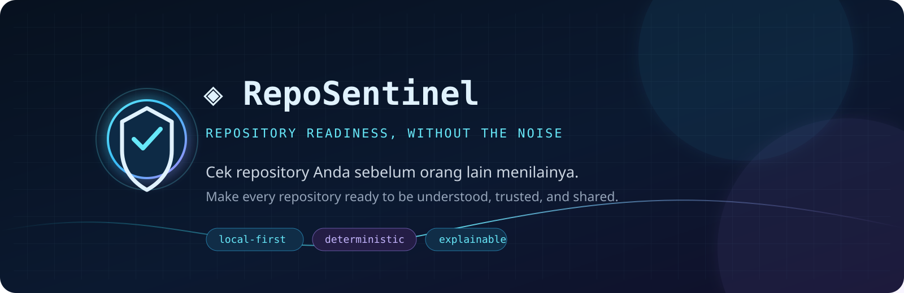
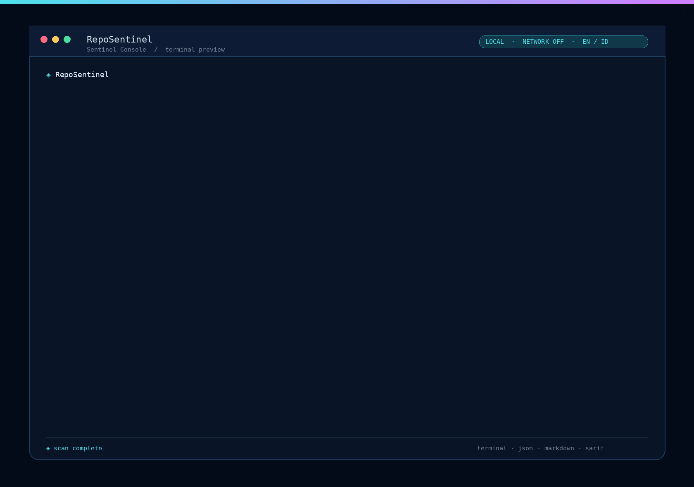
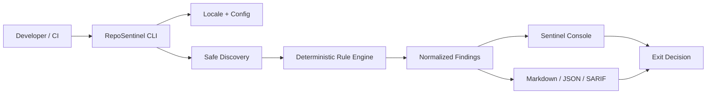

<div align="center">



[](docs/ROADMAP_BETA_PRODUCTION.md)
[](docs/RepoSentinel_Project_Context.md)
[](docs/TECH_STACK_DECISIONS.md)

**Repository readiness, without the noise.**  
*Cek repository Anda sebelum orang lain menilainya.*

[English](#english) · [Bahasa Indonesia](#bahasa-indonesia) · [Roadmap](docs/ROADMAP_BETA_PRODUCTION.md) · [CLI UX](docs/RepoSentinel_CLI_Visual_Interaction_Spec.md) · [Security boundary](docs/RepoSentinel_Tech_Stack_and_Rule_Engine.md)

</div>

> **Important / Penting:** RepoSentinel is currently a **concept specification / MVP planning project**. The package, commands, GitHub Action, documentation URLs, and CLI screenshots in this repository describe the target product experience until implementation and verification are complete.

---

## English

### The idea

Good code can still look unready when the README is unclear, Quick Start is missing, demo links are broken, screenshots do not resolve, package metadata conflicts, `.env` enters Git, or contributors do not know where to begin.

RepoSentinel is a planned developer tool that checks the layer around the code: **documentation, discoverability, links, assets, package hygiene, Git metadata, security hygiene, CI configuration, and contributor readiness**. It is designed to feel like a calm, actionable repository linter—not a wall of cryptic warnings.

### What makes it different

| Pillar | What it means |
|---|---|
| **Local-first** | Source code stays on the user’s machine during local scans. Network rules are opt-in. |
| **Deterministic** | The same repository and configuration produce the same normalized findings. |
| **Explainable** | Every finding has a rule ID, severity, location, evidence, impact, and remediation. |
| **Profile-driven** | `public`, `portfolio`, and `npm-package` repositories have different readiness needs. |
| **Safe by default** | The scanner reads the target as data and does not run its package scripts or build commands. |
| **Multilingual** | UI copy and documentation can be localized while rule IDs and machine schemas remain stable. |

### What it checks

```text
README & docs       Quick Start · description · headings · structure
Links & assets      URLs · images · badges · demo references
Security hygiene    .env · private keys · high-confidence credential patterns
Package hygiene     lockfiles · manifest · scripts · package metadata
Git metadata        .gitignore · tracked generated files · large files
Community           license presence · issue templates · contributor readiness
CI & automation     workflow permissions · release metadata · syntax hints
Portfolio profile   summary · tech stack · screenshot · visible demo
```

### Target experience

```text
install → check → understand finding → fix → check again → share
```

A successful interactive scan is designed to look like this:

```text
◈ RepoSentinel 0.1.0  ·  portfolio-app
  local scan · network off · locale en

╭─ health snapshot ─────────────────────────────────────────────╮
│  86 / 100   ALMOST READY                                      │
│  0 critical · 0 error · 2 warnings · 3 info                   │
╰────────────────────────────────────────────────────────────────╯

  › ! documentation.quickstart   README.md:18       warning
      README has no runnable installation command
  ◇   links.valid                README.md:31       warning
      Link could not be resolved

  ↑↓ select · enter details · f filter · r rescan · o report · q quit

  Result: passed with warnings                                      exit 0
```

### Sentinel Console in motion

The terminal UI uses a dark navy canvas with a cyan-to-violet accent line, cyan panel borders, muted context text, yellow warnings, red errors, and cyan info markers. Color is forced in interactive mode and can always be disabled with `--no-color` for CI, pipes, SSH fallback, and machine output.



[Open the full MP4 terminal demo](docs/assets/reposentinel-cli-demo.mp4) · [View the warning-state screenshot](docs/assets/reposentinel-terminal-scan.png) · [View the 100/100 ready screenshot](docs/assets/reposentinel-terminal-ready.png)

| Token | Tone | Meaning |
|---|---|---|
| `cyan` | `#4DE0EB` | Brand, panel accents, info, interactive focus |
| `violet` | `#D27EFF` | Secondary brand accent and visual identity |
| `yellow` | `#FFCB5C` | Warning and attention |
| `red` | `#FF6F84` | Error and critical severity |
| `slate` | `#75849A` | Remediation, metadata, and secondary context |

### Quick Start

> **Current status:** the package is still under implementation. The commands below show the target user journey and will become executable as the CLI MVP is completed.

```bash
# After the package is published
npx reposentinel check . --lang en

# During local development
pnpm install
pnpm build
node packages/cli/dist/index.js check . --lang id
```

### Target commands

> These are **planned UX contracts**, not a claim that the package is already published.

```bash
# One-shot local scan
npx reposentinel check .

# Scan with a profile and Indonesian UI
reposentinel check . --profile portfolio --lang id

# Inspect security rules
reposentinel rules --category security --lang en

# Explain one finding
reposentinel explain documentation.quickstart --lang id

# Export a machine-readable report
reposentinel check . --format json --lang en > report.json

# Export a Markdown report
reposentinel report . --format markdown --output report.md

# Explore rules and explain one rule
reposentinel rules --category security --lang id
reposentinel explain security.private-key --lang id
```

The target language resolution order is `--lang`, `REPOSENTINEL_LANG`, config, interactive environment hint, then deterministic English fallback. Rule IDs, config keys, JSON keys, exit codes, and schema version stay stable across languages.

### Architecture at a glance



### Project status

| Area | Status |
|---|---|
| Product context and scope | `implemented` as documentation |
| Bilingual README direction | `implemented` as documentation |
| CLI visual interaction specification | `implemented` as documentation |
| Multilingual architecture decision | `implemented` as documentation |
| Core engine | `implemented` as deterministic development foundation |
| Rule pack | `implemented` as initial 16-rule pack |
| CLI package | `implemented` as local development CLI |
| GitHub Action | `implemented` as composite action and source-checkout workflow |
| Dogfooding and hardening | `implemented` as local self-scan and safety gates |
| npm publication | `planned` |
| Beta production | `beta candidate published` as `v0.1.0-beta.1`; pilot sign-off pending |

### Safety boundaries

RepoSentinel is not a SAST replacement, enterprise secret scanner, full dependency vulnerability scanner, or formal security audit. A successful score must never be described as proof that a repository is secure.

During a local scan, RepoSentinel should not send source code to a server, call the network by default, execute `npm install`, execute package scripts, run build hooks, follow symlinks outside the target root, or print secret values. Security findings must show safe path/line context and redacted evidence only.

### Read the design docs

| Document | Purpose |
|---|---|
| [Project Context](docs/RepoSentinel_Project_Context.md) | Product source of truth, scope, principles, and acceptance criteria. |
| [Tech Stack & Rule Engine](docs/RepoSentinel_Tech_Stack_and_Rule_Engine.md) | Core architecture, findings, rule contract, fixtures, and security boundary. |
| [CLI Case Examples](docs/RepoSentinel_CLI_Case_Examples.md) | All target commands, success cases, warnings, errors, reports, and exit codes. |
| [Visual & Interactive CLI](docs/RepoSentinel_CLI_Visual_Interaction_Spec.md) | Sentinel Console panels, keyboard navigation, themes, fallback, and CI mode. |
| [Tech Stack Decisions](docs/TECH_STACK_DECISIONS.md) | Node.js, TypeScript, CLI, localization, performance, and dependency decisions. |
| [Beta Production Roadmap](docs/ROADMAP_BETA_PRODUCTION.md) | One-by-one stages from repository bootstrap to beta production. |

---

## Bahasa Indonesia

### Gagasannya

Kode yang baik tetap dapat terlihat belum siap ketika README sulit dipahami, Quick Start tidak tersedia, link demo rusak, screenshot tidak tampil, metadata package tidak konsisten, `.env` ikut masuk Git, atau contributor tidak tahu harus mulai dari mana.

RepoSentinel adalah rancangan developer tool untuk memeriksa lapisan di sekitar kode: **dokumentasi, discoverability, link, asset, package hygiene, metadata Git, security hygiene, konfigurasi CI, dan kesiapan contributor**. Pengalaman yang dituju adalah repository linter yang tenang dan actionable—bukan dinding warning yang sulit dipahami.

### Prinsip produk

| Pilar | Makna |
|---|---|
| **Local-first** | Source code tetap berada di perangkat pengguna saat local scan. Network rule bersifat opt-in. |
| **Deterministic** | Repository dan konfigurasi yang sama menghasilkan finding yang sama. |
| **Explainable** | Setiap finding memiliki rule ID, severity, lokasi, evidence, dampak, dan remediation. |
| **Profile-driven** | Repository `public`, `portfolio`, dan `npm-package` memakai konteks pemeriksaan yang berbeda. |
| **Safe by default** | Scanner membaca repository sebagai data dan tidak menjalankan package script atau build command. |
| **Multilingual** | UI dan dokumentasi dapat diterjemahkan tanpa mengubah rule ID dan schema machine output. |

### Bahasa yang direncanakan

MVP dimulai dengan **English (`en`)** dan **Bahasa Indonesia (`id`)**. Bahasa lain dapat ditambahkan melalui message catalog tanpa mengubah detector. Command, rule ID, configuration key, schema, dan exit code tetap memakai identifier teknis yang stabil agar script dan CI tidak rusak.

```bash
# Bahasa Indonesia pada terminal interaktif
reposentinel check . --profile portfolio --lang id

# Bahasa English untuk CI yang deterministik
CI=true reposentinel check . --lang en --format json

# Jelajahi rule dan buat report Markdown
reposentinel rules --category security --lang id
reposentinel report . --format markdown --output report.md --lang id
```

### Quick Start

> **Status saat ini:** package masih dalam tahap implementasi. Command berikut menunjukkan alur target dan command development yang dapat digunakan setelah workspace disiapkan.

```bash
pnpm install
pnpm build
node packages/cli/dist/index.js check . --lang id
```

### Tahapan menuju beta production

```text
repository bootstrap
        ↓
governance + branch hygiene
        ↓
workspace + core contract
        ↓
safe discovery + 15 rule fixtures
        ↓
Sentinel Console + plain/JSON/Markdown reporters
        ↓
CLI MVP + package smoke test
        ↓
CI + GitHub Action
        ↓
dogfooding + closed beta
        ↓
beta production
```

Lihat [roadmap lengkap](docs/ROADMAP_BETA_PRODUCTION.md) untuk pekerjaan satu per satu, definition of done, risk control, release gate, dan urutan issue.

### Visual terminal dan demo

Tampilan terminal menggunakan canvas navy gelap dengan aksen cyan-ke-violet, border panel cyan, metadata slate, warning kuning, error merah, dan info cyan. Pada terminal interaktif warna dipertahankan; gunakan `--no-color` untuk CI, pipe, SSH fallback, atau output machine.


[Open demo MP4](docs/assets/reposentinel-cli-demo.mp4) · [Lihat screenshot warning](docs/assets/reposentinel-terminal-scan.png) · [Lihat screenshot 100/100 ready](docs/assets/reposentinel-terminal-ready.png)

### Status saat ini

Repository ini sudah melewati tahap fondasi dokumentasi dan memasuki tahap beta candidate. README bilingual, visual CLI specification, multilingual architecture, tech stack decision, roadmap, issue template, PR template, core engine, safe discovery, config loader, initial rule pack, local development CLI, reporter Markdown/JSON, GitHub Action, dogfooding, dan hardening gate sudah tersedia. Package `reposentinel` beta candidate `v0.1.0-beta.1` sudah diterbitkan sebagai GitHub prerelease; pilot sign-off dan stabilisasi lanjutan tetap diperlukan sebelum release stable.

---

## Tech stack target

| Layer | Pilihan |
|---|---|
| Runtime | Node.js 24 LTS |
| Language | TypeScript strict |
| Workspace | pnpm workspace |
| CLI parser | Commander |
| Interactive prompts | `@clack/prompts` |
| Config | `yaml` + `zod` |
| Discovery | `fast-glob` + `ignore` |
| Markdown | Unified/Remark AST |
| Test | Vitest |
| Reporters | Custom deterministic terminal, Markdown, JSON, SARIF |

Keputusan ini mengutamakan runtime LTS, dependency yang terukur, core engine yang terpisah dari UI, dan kemampuan fallback untuk CI/SSH. Detailnya ada di [Tech Stack Decisions](docs/TECH_STACK_DECISIONS.md).

## Contributing

Pada tahap awal, perubahan harus diawali dengan `context → problem → proposed solution → acceptance criteria → dependencies → risks`. Rule baru wajib memiliki rule ID stabil, kategori, severity, detector, evidence, remediation, fixture positif/negatif, regression test, dan dokumentasi.

Sebelum membuka pull request, jalankan check yang tersedia dan jelaskan dampak security/privacy. Jangan mengirim secret atau source code sensitif pada issue, log, screenshot, atau fixture.

## References

- [Project Context & Source of Truth](docs/RepoSentinel_Project_Context.md)
- [Tech Stack and Rule Engine](docs/RepoSentinel_Tech_Stack_and_Rule_Engine.md)
- [Node.js Releases](https://nodejs.org/en/about/previous-releases)
- [Commander.js](https://github.com/tj/commander.js/)
- [Clack Getting Started](https://bomb.sh/docs/clack/basics/getting-started/)
